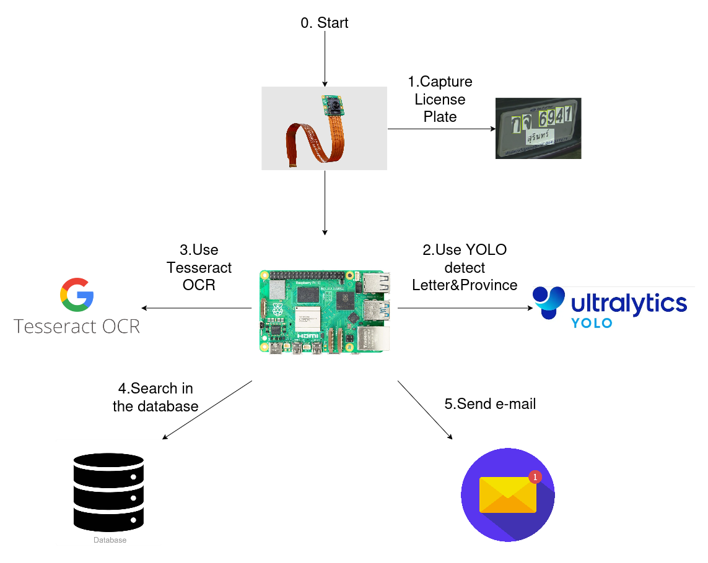

# 🚀 Project Progress Report

> **Info:**
> **Group:** 5 | **Section:** 2
> **Date:** (ระบุวันที่ส่งงาน)

---

## 1. 📝 Project Title
**ระบบตรวจจับป้ายทะเบียนสำหรับที่จอดรถ (License Plate Recognition for Parking Facilities)**

## 2. 👥 Group Members

| No. | Student ID | Name | Responsibility (Role) |
|:---:|:----------:|:-----|:----------------------|
| 1 | B6603892 | นายศุภณัฐ สิงหา | Backend |
| 2 | B6608019 | นางสาวเนตรนภัทร ชำนินอก | Frontend |
| 3 | B6609023 | นายณัฐสิทธิ์ มามั่น | E-Mail Service |
| 4 | B6627065 | นายกิตติศักดิ์ ชิ้นทอง | Create LPR Service |

---

## 3. 💡 Background and Rationale
1. ที่มาและความสำคัญ
ปกติการจัดการรถเข้า-ออกบริษัทต้องใช้ รปภ. คอยจดบันทึก หรือใช้ระบบคีย์การ์ด ซึ่งมีความยุ่งยากและมีต้นทุนในการทำบัตร ปัจจุบันเทคโนโลยี AI และกล้องเริ่มเข้าถึงง่ายขึ้น จึงอยากลองนำระบบ "ตรวจจับป้ายทะเบียน (LPR)" มาใช้แทน เพื่อให้ไม้กั้นเปิดเองอัตโนมัติ ช่วยลดงานคน และเพิ่มฟีเจอร์แจ้งเตือนผ่านอีเมลเพื่อให้เจ้าของรถรู้ความเคลื่อนไหวทันที ซึ่งสะดวกและประหยัดกว่าระบบเดิม
2. ปัญหาที่ต้องการแก้ไข (Pain Points)

    สิ้นเปลือง: ระบบคีย์การ์ดมีต้นทุน ต้องซื้อบัตรเพิ่มเรื่อยๆ และบ่อยครั้งที่บัตรหายหรือชำรุด

    รปภ. ทำงานหนัก: การต้องคอยดูทะเบียนรถทุกคันทำให้เกิดความเหนื่อยล้าและไม่คุ้มทุนค่าจ้าง
    
    ขาดการแจ้งเตือน: ระบบทั่วไป หากรถถูกขับออกไปโดยคนอื่น เจ้าของรถจะไม่รู้ตัวเลยจนกว่าจะกลับมาที่ลานจอด

## 4. 🎯 Objectives
* [ ] **Objective 1:** เพื่อเพิ่มความปลอดภัยในพื้นที่ของบริษัท โดยมีการแจ้งเตือนไปที่อีเมล์เจ้าของรถทั้งขาเข้าและขาออก
* [ ] **Objective 2:** เพื่อลดภาระงานของเจ้าหน้าที่รักษาความปลอดภัย (รปภ.)

## 5. 🧩 Project Workflow
> *แผนภาพแสดงการทำงานของระบบ (System Flow) หรือ Architecture*

## 6. 🎥 Demo / Preview
> *คลิปแสดงตัวอย่างการทำงานเบื้องต้น*

* **Video Link:** [คลิกเพื่อรับชม Video](URL_HERE)
* **Remark:** (หมายเหตุเพิ่มเติม ถ้ามี)

---

## 7. 📊 Current Progress
*(สรุปสิ่งที่ทำเสร็จสิ้นแล้ว)*

* **Part 1:** ...
* **Part 2:** ...

## 8. 📅 Next Steps
*(แผนการดำเนินงานในขั้นต่อไป)*

1.  (ระบุงานที่จะทำต่อ)
2.  (ระบุงานที่จะทำต่อ)