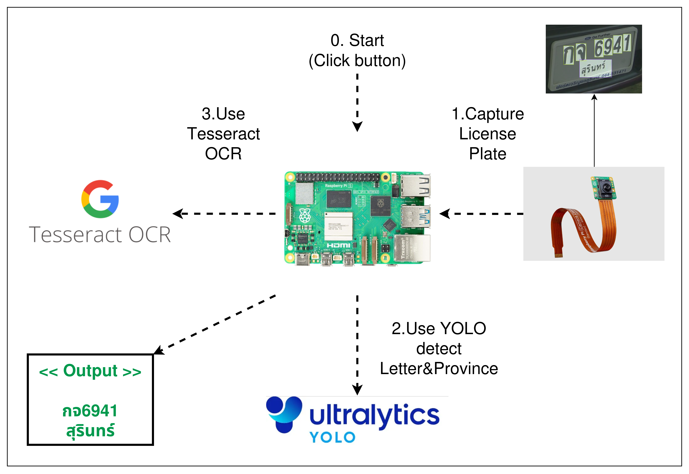

# 🚀 Project Progress Report

> **Info:**
> **Group:** 5 | **Section:** 2
> **Date:** 5 มกราคม 2569

---

## 1. 📝 Project Title
**เครื่องอ่านป้ายทะเบียนจาก Raspberry Pi (License Plate Recognition By Raspberry Pi)**

## 2. 👥 Group Members

| No. | Student ID | Name | Responsibility (Role) |
|:---:|:----------:|:-----|:----------------------|
| 1 | B6603892 | นายศุภณัฐ สิงหา | Province Name Normalization |
| 2 | B6608019 | นางสาวเนตรนภัทร ชำนินอก | Frontend UI & Component |
| 3 | B6609023 | นายณัฐสิทธิ์ มามั่น | Tesseract OCR |
| 4 | B6627065 | นายกิตติศักดิ์ ชิ้นทอง | Model Trainer |

---

## 3. 💡 Background and Rationale
1. ที่มาและความสำคัญ

    เครื่องอ่านป้ายทะเบียนจริงๆ จะมีราคาแพงและต้นทุนสูง
    เราจึงต้องการ ทำเครื่องอ่านป้ายทะเบียนรถยนต์ บนอุปกรณ์ขนาดเล็ก (Edge Device)
    เพื่อใช้ในการอ่านป้ายทะเบียน และช่วยให้ใช้ต้นทุนต่ำลง

2. ปัญหาที่ต้องการแก้ไข (Pain Points)

    การใช้ระบบอ่านป้ายทะเบียนทั่วไปบนอุปกรณ์ที่มีทรัพยากรจำกัด
    มักพบปัญหาความคลาดเคลื่อนของข้อมูลตัวอักษรส่วนจังหวัด เมื่อภาพป้ายทะเบียนไม่สมบูรณ์ เช่น ภาพไม่ชัด
    ทำให้ข้อมูลจังหวัดที่อ่านไม่ถูกต้อง

## 4. 🎯 Objectives
* **Objective 1:** สร้างเครื่องอ่านป้ายทะเบียน: โดยใช้ Raspberry Pi ร่วมกับโมเดล YOLO และ Tesseract OCR
* **Objective 2:** ปรับปรุงความแม่นยำของผลลัพธ์: เพิ่มฟังก์ชันการขัดเกลาข้อความ (Text Refinement) เพื่อลดความผิดพลาดในการอ่านชื่อจังหวัด

## 5. 🧩 Project Workflow
> *แผนภาพแสดงการทำงานของระบบ (System Flow) หรือ Architecture*
1. กดปุ่มเริ่มสแกนป้ายทะเบียน
2. ใช้โมเดล Yolo และ tesseract ในการตรวจจับแยกตัวหนังสือกับจังหวัด
3. ปรับแก้ไขคำผิดในส่วนของจังหวัด(หากผลลัพธ์ของจังหวัด มีความคลาดเคลื่อน)
4. แสดงผลลัพธ์การอ่านป้ายทะเบียน

## 6. 🎥 Demo / Preview
> *คลิปแสดงตัวอย่างการทำงานเบื้องต้น*

* **Video Link:** [คลิกเพื่อรับชม Video](URL_HERE)
* **Remark:** (ยังอยู่ในขั้นตอนที่ยังไม่มีการปรับปรุงความแม่นยำการอ่านจังหวัด)

---

## 7. 📊 Current Progress

* **Part 1:** เทรนโมเดล และ ทดลองใช้
* **Part 2:** อ่านคำบนป้ายทะเบียน

## 8. 📅 Next Steps

1.  สร้างหน้า UI & Component
2.  ปรับแก้ไขความแม่นยำของจังหวัด